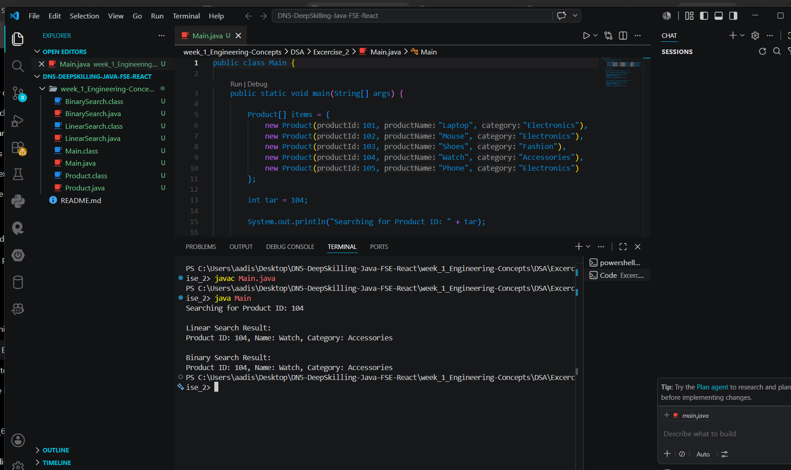

# Exercise 2 - E-commerce Platform Search Function

## Objective

This exercise demonstrates the implementation of **search functionality for an e-commerce platform** using two searching algorithms:

* **Linear Search**
* **Binary Search**

The goal is to compare their working and time complexity while searching for a product using **productId**.

---

## Files Used

* **Product.java** → Stores product details (`productId`, `productName`, `category`)
* **LinearSearch.java** → Implements linear search
* **BinarySearch.java** → Implements binary search
* **Main.java** → Creates sample products, performs both searches, and displays the result

---

## How the Exercise Works

A list of products is stored in an array.  
In this implementation, the program searches for **Product ID 104** from a sample product list.

The program searches for the given product ID using:

### Linear Search

* Checks each product one by one from the beginning
* Works even if the data is unsorted

### Binary Search

* Searches by repeatedly dividing the sorted array into halves
* Faster than linear search for large datasets
* Requires the array to be sorted

---

## Complexity Analysis

| Algorithm     | Best Case | Average Case | Worst Case |
| ------------- | --------- | ------------ | ---------- |
| Linear Search | O(1)      | O(n)         | O(n)       |
| Binary Search | O(1)      | O(log n)     | O(log n)   |

---

## Conclusion

* **Linear Search** is simple and works on unsorted data.
* **Binary Search** is more efficient for large product datasets because it reduces the search time significantly.

For an e-commerce platform with many products, **Binary Search is the better choice when the data is sorted**.

---

## Output Screenshot

