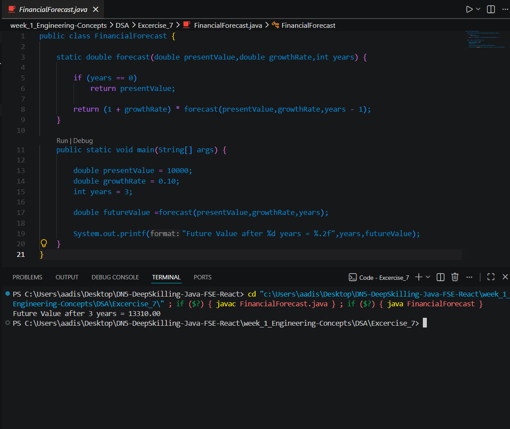

# Exercise 7 - Financial Forecasting

## Objective
Predict future values using recursion.

## Recursion Concept
Recursion is a technique where a method calls itself to solve a smaller subproblem.
A recursive solution must have:
- Base case
- Recursive case

## Problem Statement
Given a present value, growth rate, and number of years, predict the future value.

## Formula
Future Value = Present Value × (1 + growthRate)^years

## Recursive Algorithm
Base Case:
If years == 0, return presentValue

Recursive Case:
Return (1 + growthRate) * forecast(presentValue, growthRate, years - 1)

## Java Code
(put your code here or explain that code is in FinancialForecast.java)

## Sample Output
Future Value after 3 years = 13310.00

## Output Screenshot

## Time Complexity
O(n)

## Space Complexity
O(n)

## Optimization
The recursive approach makes n recursive calls and uses stack space.
It can be optimized using an iterative approach to reduce space complexity to O(1).