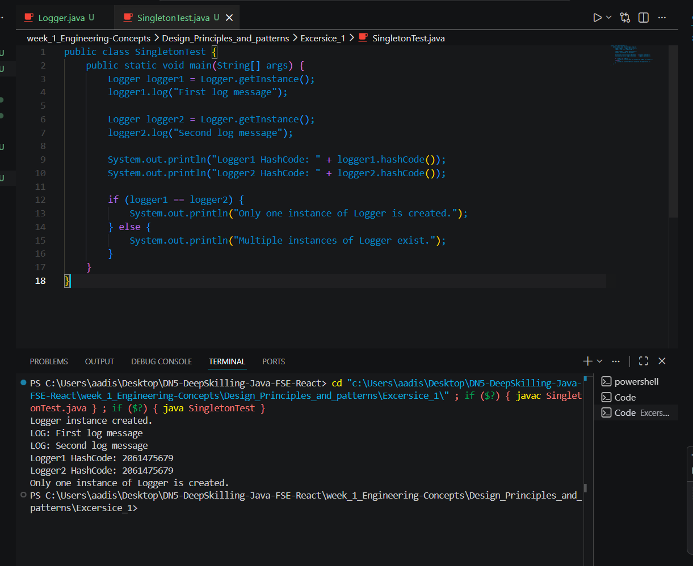

# Exercise 1 - Implementing the Singleton Pattern

## Objective
This exercise demonstrates the implementation of the **Singleton Design Pattern** in Java using a `Logger` class.

The goal is to ensure that only **one instance** of the logger is created and shared throughout the application lifecycle.

---

## Problem Statement
A logging utility is commonly used across multiple parts of an application.  
If multiple logger objects are created, it may lead to inconsistent behavior and unnecessary object creation.

To solve this, the `Logger` class is implemented using the **Singleton Pattern**, which restricts object creation to a single instance and provides a global access point to it.

---

## Singleton Pattern Used
The Singleton Pattern ensures that:
- only one object of a class exists
- the same instance is returned whenever needed
- object creation is controlled centrally

---

## Implementation Details

### `Logger.java`
The `Logger` class is designed as a Singleton by:
- declaring a **private static instance** of the class
- making the **constructor private**
- providing a **public static `getInstance()` method** to access the object
- adding a `log()` method to simulate logging messages

### `SingletonTest.java`
The test class:
- calls `Logger.getInstance()` multiple times
- prints log messages using the logger
- compares hash codes / object references
- verifies that only one logger instance is created

---

## Output Screenshot

