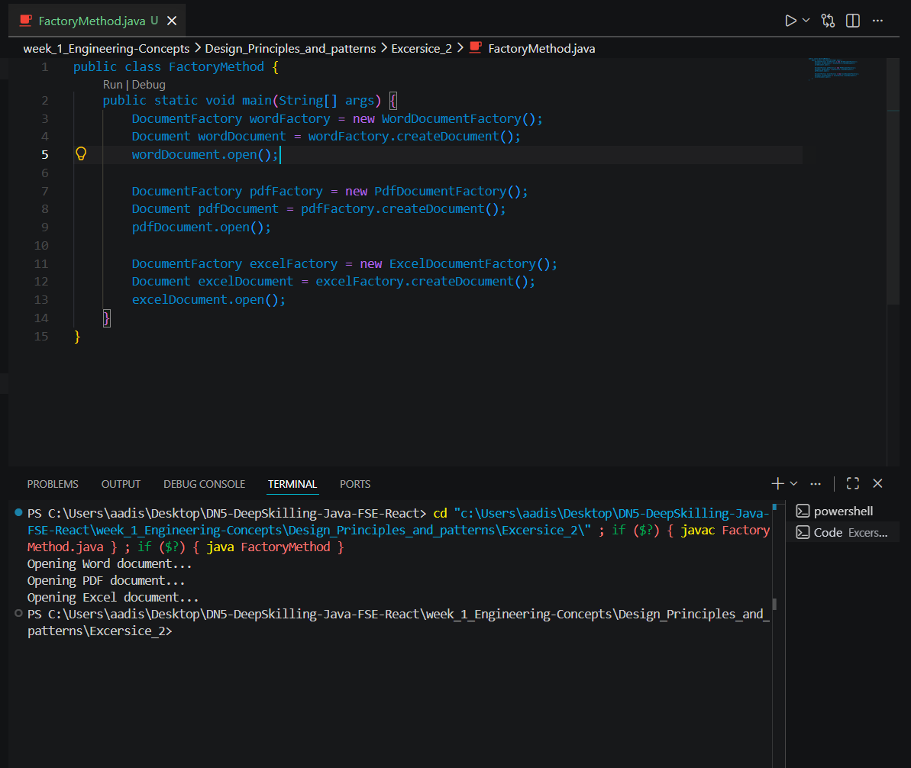

# Exercise 2 - Factory Method Pattern

## Problem Statement

A document management system needs to support the creation of multiple document types such as **Word**, **PDF**, and **Excel**. The system should be designed in a way that object creation is handled efficiently without tightly coupling the client code to specific document classes.

## Objective

The objective of this exercise is to implement the **Factory Method Design Pattern** in Java to create different document types through dedicated factory classes. This ensures that the object creation process is abstracted from the client and can be extended easily for additional document formats in the future.

## Design Pattern Applied

This exercise uses the **Factory Method Pattern**, a creational design pattern that defines an interface or abstract method for creating objects while allowing subclasses to decide which concrete object to instantiate.

## Implementation Overview

The solution introduces a common `Document` interface to represent the general behavior of all document types. Concrete classes such as `WordDocument`, `PdfDocument`, and `ExcelDocument` implement this interface to provide document-specific behavior.

An abstract factory class `DocumentFactory` defines the factory method `createDocument()`. Concrete factory classes such as `WordDocumentFactory`, `PdfDocumentFactory`, and `ExcelDocumentFactory` extend this factory and create the corresponding document objects.

The client interacts with the factory classes rather than directly instantiating document objects, thereby achieving separation of concerns and improved maintainability.

## Outcome

The implementation successfully demonstrates the **Factory Method Pattern** by delegating document creation to specialized factory classes. This approach reduces direct dependency on concrete classes, improves code organization, and makes the system easier to extend with new document types in the future.

## Output Screenshot

