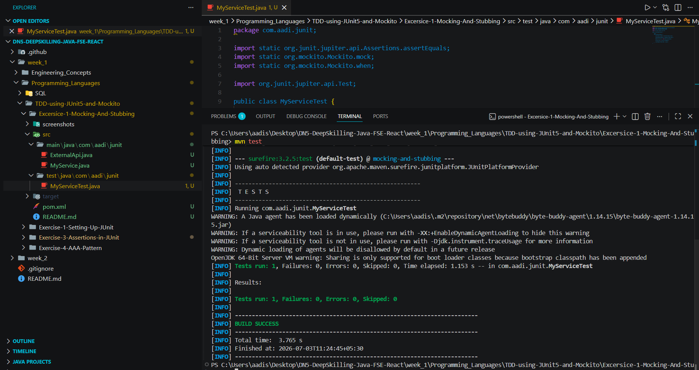

# Exercise 1 – Mocking and Stubbing

## Problem Statement

Test a service that depends on an external API by using Mockito to create a mock object and stub its method.

## Objective

- Create a mock of the external API.
- Stub the API method to return predefined data.
- Verify the service retrieves the mocked data correctly.

## Concepts Used

- JUnit 5
- Mockito
- Mocking
- Stubbing
- Maven

## Project Structure

```
MockingAndStubbing
│── pom.xml
│── README.md
│── screenshots
│   └── build-success.png
└── src
    ├── main
    │   └── java/com/aadi/junit
    │       ├── ExternalApi.java
    │       └── MyService.java
    └── test
        └── java/com/aadi/junit
            └── MyServiceTest.java
```

## Output

```
Tests run: 1
Failures: 0
Errors: 0
BUILD SUCCESS
```

## Expected Outcome

The test successfully verifies that the service returns the mocked data from the external API.

## Output Screenshots

