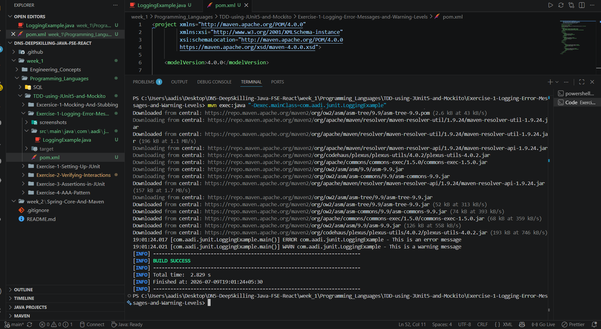

# Exercise 1 - Logging Error Messages and Warning Levels

## Problem Statement

Write a Java application that demonstrates logging error messages and warning levels using the SLF4J logging framework.

## Objective

Demonstrate the use of the SLF4J logging framework with Logback to log messages at different logging levels.

## Concepts Used

- Java
- Maven
- SLF4J
- Logback
- Logging Framework

## Project Structure

```text
Exercise-1-Logging-Error-Messages-and-Warning-Levels
│
├── screenshots
│   └── screenshot.png
│
├── src
│   └── main
│       └── java
│           └── com
│               └── aadi
│                   └── junit
│                       └── LoggingExample.java
│
├── pom.xml
└── README.md
```
## Expected Outcome

The application successfully logs an error message and a warning message using the SLF4J logging framework with Logback. The project compiles and executes successfully using Maven.

## Output Screenshot

