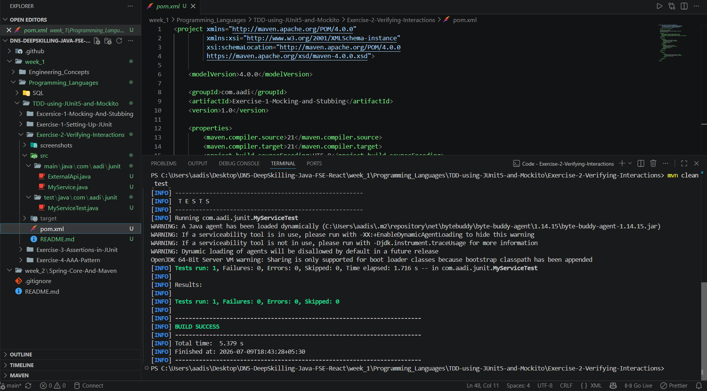

# Exercise 2 - Verifying Interactions

## Problem Statement

Test a service that depends on an external API using Mockito and verify that the expected method is invoked on the mocked object.

## Objective

Demonstrate interaction verification using Mockito with JUnit 5 by ensuring that a method is called on a mock object.

## Concepts Used

- JUnit 5
- Mockito
- Mock Objects
- Interaction Verification
- Maven

## Project Structure

```text
Exercise-2-Verifying-Interactions
│
├── screenshots
│   └── screenshot.png
│
├── src
│   ├── main
│   │   └── java
│   │       └── com
│   │           └── aadi
│   │               └── junit
│   │                   ├── ExternalApi.java
│   │                   └── MyService.java
│   │
│   └── test
│       └── java
│           └── com
│               └── aadi
│                   └── junit
│                       └── MyServiceTest.java
│
├── pom.xml
└── README.md
```


## Expected Outcome

The unit test successfully verifies that the `getData()` method of the mocked `ExternalApi` is invoked. The project builds successfully, and all tests pass without failures.

## Output Screenshot

