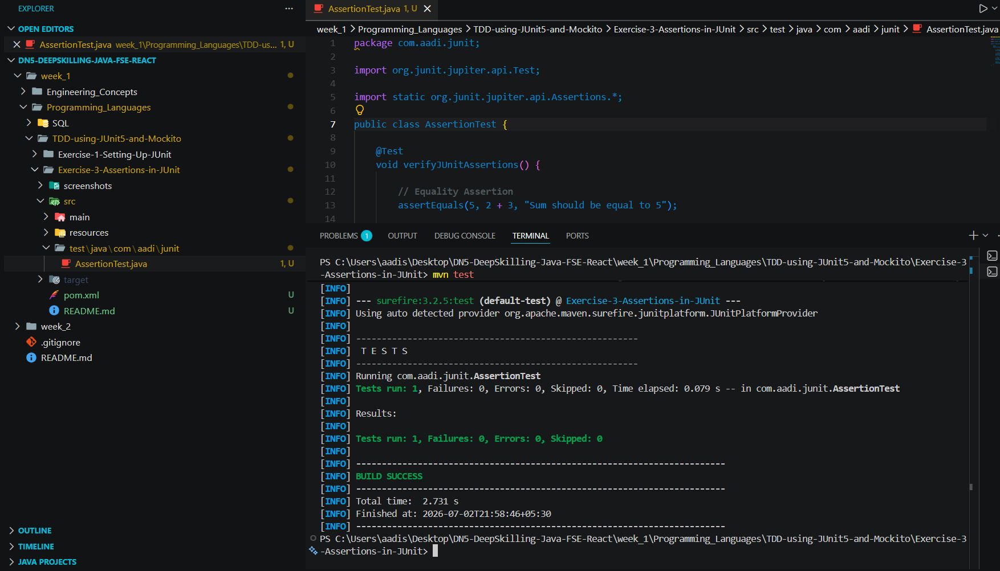

# Exercise 3 - Assertions in JUnit

## Problem Statement

Implement unit tests using different JUnit 5 assertion methods to validate expected outcomes. This exercise demonstrates how assertions are used to verify application behavior and ensure correctness during unit testing.

## Objective

- Understand the purpose of assertions in JUnit 5.
- Verify expected and actual results using different assertion methods.
- Learn how assertions help identify incorrect program behavior.

## Assertions Used

- `assertEquals()`
- `assertTrue()`
- `assertFalse()`
- `assertNull()`
- `assertNotNull()`

## Expected Outcome

All assertions execute successfully, confirming that the expected conditions are satisfied and the test passes without failures.

## Output

