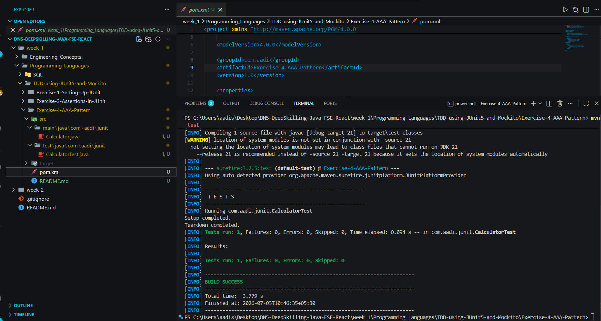

# Exercise 4 – Arrange-Act-Assert (AAA) Pattern, Test Fixtures, Setup and Teardown Methods in JUnit

## Problem Statement

Develop JUnit test cases using the Arrange-Act-Assert (AAA) pattern and implement test fixtures with setup and teardown methods.

## Objective

* Create unit tests using JUnit 5.
* Organize test cases using the Arrange-Act-Assert (AAA) pattern.
* Initialize required objects before each test using `@BeforeEach`.
* Release resources after each test using `@AfterEach`.

## Concepts Used

* JUnit 5
* Arrange-Act-Assert (AAA) Pattern
* Test Fixtures
* `@BeforeEach`
* `@AfterEach`
* `assertEquals()`

## Project Structure

```text
Exercise-4-AAA-Pattern
│
├── src
│   ├── main
│   │   └── java
│   │       └── com
│   │           └── aadi
│   │               └── junit
│   │                   └── Calculator.java
│   │
│   └── test
│       └── java
│           └── com
│               └── aadi
│                   └── junit
│                       └── CalculatorTest.java
│
├── screenshots
│   ├── output.png
│   
│
├── pom.xml
└── README.md
```

## Output Screenshots





## Expected Outcome

The test executes successfully by following the Arrange-Act-Assert (AAA) pattern. The test fixture is initialized before execution using `@BeforeEach`, the addition operation is verified using `assertEquals()`, and resources are cleaned up after execution using `@AfterEach`.
