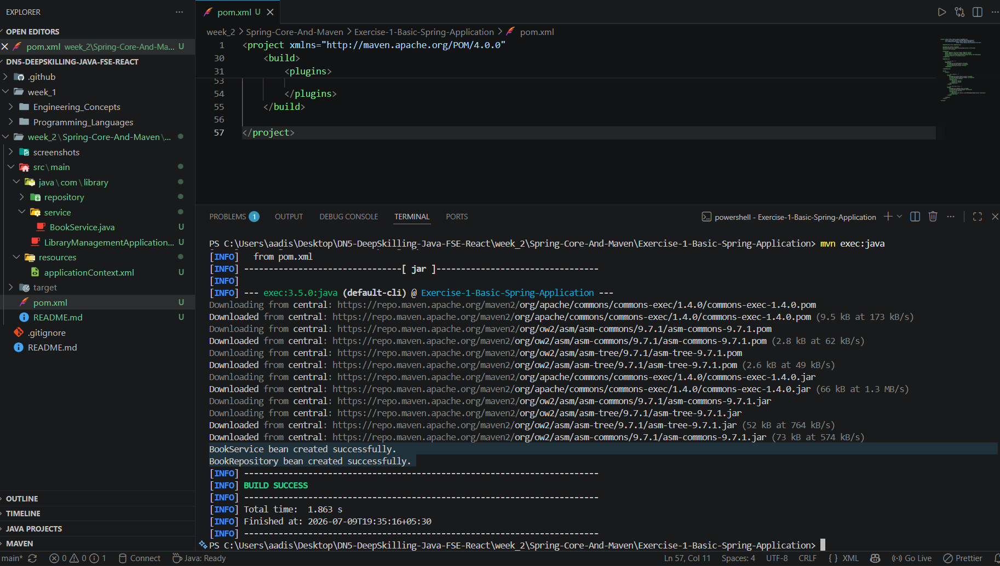

# Exercise 1 - Configuring a Basic Spring Application

## Problem Statement

Configure a basic Spring application using XML configuration. Define beans for `BookService` and `BookRepository`, load the Spring Application Context, and verify that the beans are created successfully.

## Objective

Create a basic Spring application using the Spring IoC Container and XML-based bean configuration.

## Concepts Used

- Java
- Maven
- Spring Framework
- Spring IoC
- XML Bean Configuration

## Project Structure

```text
Exercise-1-Basic-Spring-Application
│
├── screenshots
│   └── screenshot.png
│
├── src
│   ├── main
│   │   ├── java
│   │   │   └── com
│   │   │       └── library
│   │   │           ├── LibraryManagementApplication.java
│   │   │           ├── repository
│   │   │           │   └── BookRepository.java
│   │   │           └── service
│   │   │               └── BookService.java
│   │   └── resources
│   │       └── applicationContext.xml
│
├── pom.xml
└── README.md
```

## Output

```text
BookService bean created successfully.
BookRepository bean created successfully.

BUILD SUCCESS
```

## Expected Outcome

The application successfully loads the Spring Application Context, creates the configured beans, and retrieves them using the Spring IoC Container.

## Output Screenshot

