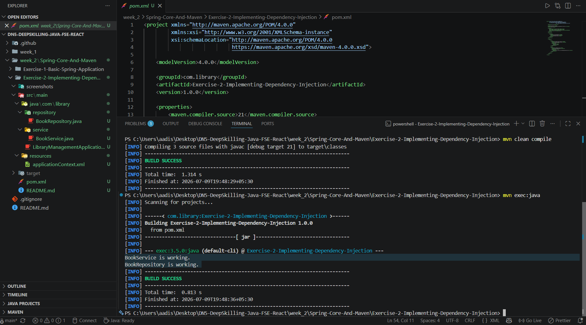

# Exercise 2 - Implementing Dependency Injection

## Problem Statement

Implement Dependency Injection in the library management application by wiring the `BookRepository` bean into the `BookService` bean using Spring's IoC container and XML configuration.

## Objective

Demonstrate Spring Dependency Injection using setter injection and XML-based bean configuration.

## Concepts Used

- Java 21
- Maven
- Spring Framework
- Spring IoC
- Dependency Injection
- Setter Injection
- XML Bean Configuration

## Project Structure

```text
Exercise-2-Implementing-Dependency-Injection
│
├── screenshots
│   └── screenshot.png
│
├── src
│   └── main
│       ├── java
│       │   └── com
│       │       └── library
│       │           ├── LibraryManagementApplication.java
│       │           ├── repository
│       │           │   └── BookRepository.java
│       │           └── service
│       │               └── BookService.java
│       │
│       └── resources
│           └── applicationContext.xml
│
├── pom.xml
└── README.md
```

## Output

```text
BookService is working.
BookRepository is working.

BUILD SUCCESS
```

## Expected Outcome

The application successfully injects the `BookRepository` bean into the `BookService` bean using Spring Dependency Injection and executes without errors.

## Output Screenshot

