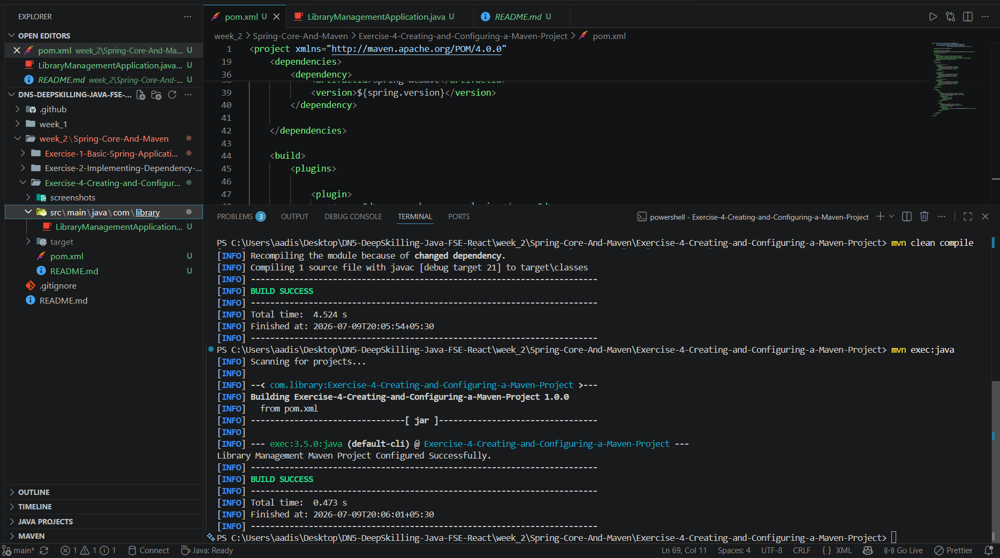

# Exercise 4 - Creating and Configuring a Maven Project

## Problem Statement

Create a Maven project for the library management application and configure it with the required Spring dependencies and Maven Compiler Plugin.

## Objective

Demonstrate how to create and configure a Maven project with Spring Context, Spring AOP, and Spring Web MVC dependencies.

## Concepts Used

- Java 21
- Maven
- Spring Context
- Spring AOP
- Spring Web MVC
- Maven Compiler Plugin

## Project Structure

```text
Exercise-4-Creating-and-Configuring-a-Maven-Project
│
├── screenshots
│   └── screenshot.png
│
├── src
│   └── main
│       └── java
│           └── com
│               └── library
│                   └── LibraryManagementApplication.java
│
├── pom.xml
└── README.md
```

## Output

```text
Library Management Maven Project Configured Successfully.

BUILD SUCCESS
```

## Expected Outcome

The Maven project is successfully configured with the required Spring dependencies and compiler plugin, and the application builds and executes successfully.

## Output Screenshot

