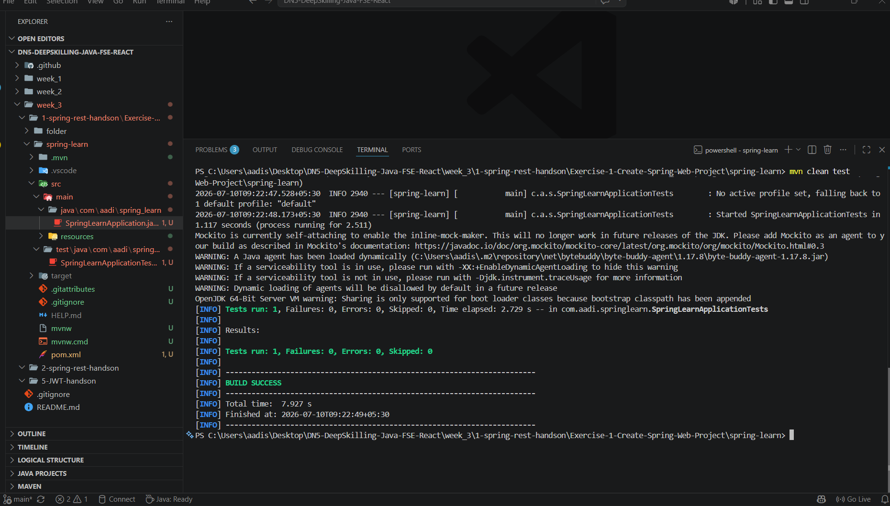

# Exercise 1 – Create a Spring Web Project using Maven

## Objective

Create a Spring Boot Web project using Maven and verify that the application starts successfully.

## Technologies Used

- Java 21
- Spring Boot 3
- Maven
- Spring Web
- Spring Boot DevTools
- VS Code

## Project Structure

```
src/
 ├── main/
 │    ├── java/
 │    └── resources/
 └── test/
```

## How to Run

```bash
mvn clean install
mvn spring-boot:run
```

The application starts on:

```
http://localhost:8083
```

## Learning Outcome

- Created a Spring Boot project using Spring Initializr.
- Built the project using Maven.
- Started the embedded Tomcat server.
- Verified successful application startup.

## Output Screenshot

