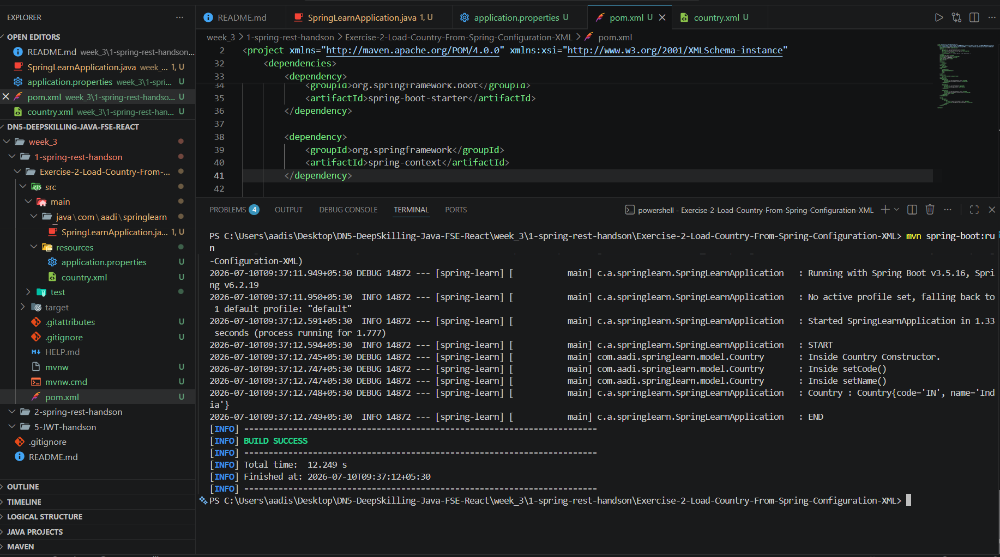

# Exercise 2 – Spring Core: Load Country from Spring Configuration XML

## Objective

Load a `Country` bean from a Spring XML configuration file using the Spring IoC Container and display the country details.

---

## Technologies Used

- Java 21
- Spring Boot 3
- Spring Framework (Spring Context)
- Maven
- VS Code

---

## Project Structure

```
spring-learn
│
├── src
│   ├── main
│   │   ├── java
│   │   │   └── com
│   │   │       └── aadi
│   │   │           └── springlearn
│   │   │               ├── SpringLearnApplication.java
│   │   │               └── model
│   │   │                   └── Country.java
│   │   │
│   │   └── resources
│   │       ├── application.properties
│   │       └── country.xml
│   │
│   └── test
│
├── pom.xml
└── README.md
```

---

## Features

- XML-based Spring Bean Configuration
- Spring IoC Container
- Bean Property Injection
- `ClassPathXmlApplicationContext`
- Logging using SLF4J

---

## How to Run

Clone the repository and navigate to the project directory.

```bash
mvn clean install
```

Run the application:

```bash
mvn spring-boot:run
```

---

## Expected Output

- Spring Boot application starts successfully.
- The `Country` bean is loaded from `country.xml`.
- Country details are displayed in the console.

---

## Output Screenshot



---

## Learning Outcome

- Learned XML-based bean configuration.
- Understood the Spring IoC Container.
- Loaded beans using `ClassPathXmlApplicationContext`.
- Retrieved beans using `getBean()`.
- Displayed bean details using Spring Boot.

