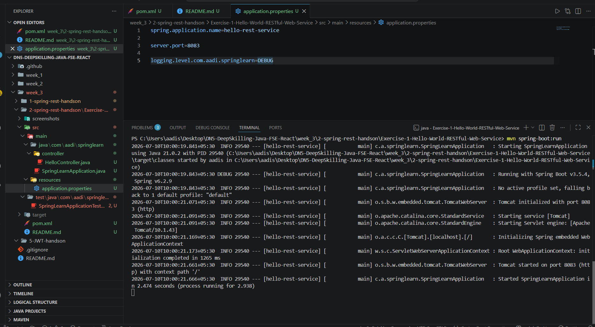

# Hello World RESTful Web Service

## Objective

Develop a simple RESTful Web Service using Spring Boot that returns a "Hello World!!" message.

---

## Technologies Used

- Java 21
- Spring Boot 3
- Spring Web
- Maven
- SLF4J Logging

---

## Project Structure

```
src
├── main
│   ├── java
│   │   └── com.aadi.springlearn
│   │       ├── SpringLearnApplication.java
│   │       └── controller
│   │           └── HelloController.java
│   └── resources
│       └── application.properties
```

---

## Features

- REST API using Spring Boot
- GET endpoint
- Returns Hello World message
- SLF4J Logging

---

## How to Run

```bash
mvn spring-boot:run
```

Open

```
http://localhost:8083/hello
```

---

## Expected Output

```
Hello World!!
```

---

## Output Screenshot



---

## Learning Outcome

- Understand Spring Boot REST Controllers.
- Learn GET Mapping.
- Understand REST API basics.
- Learn SLF4J logging.

