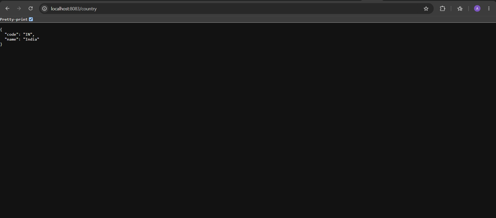
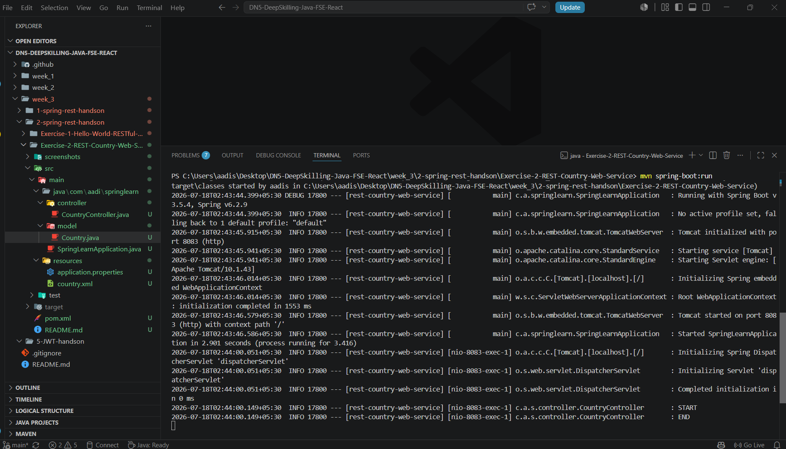

# REST - Country Web Service

## Objective

Create a RESTful Web Service that returns the details of India by loading a bean from a Spring XML configuration file.

---

## Technologies Used

- Java 21
- Spring Boot 3
- Spring Web
- Maven
- Spring XML Configuration
- SLF4J Logging

---

## Project Structure

```
src
├── main
│   ├── java
│   │   └── com.aadi.springlearn
│   │       ├── controller
│   │       ├── model
│   │       └── SpringLearnApplication.java
│   └── resources
│       ├── application.properties
│       └── country.xml
```

---

## Features

- REST API endpoint `/country`
- Loads Country bean from XML configuration
- Returns JSON response
- Uses SLF4J logging

---

## How to Run

```bash
mvn spring-boot:run
```

Open:

```
http://localhost:8083/country
```

---

## Expected Output

```json
{
  "code": "IN",
  "name": "India"
}
```

---

## Output Screenshot





---

## Learning Outcome

- Understand Spring REST Controllers.
- Learn XML-based bean configuration.
- Convert Java objects to JSON using Spring Boot.
- Load beans from XML in Spring Boot 3.
