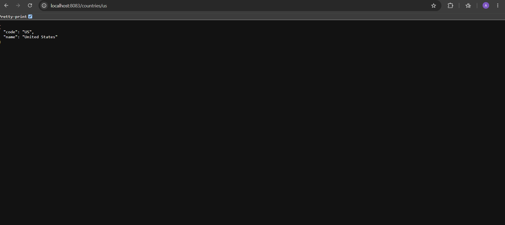
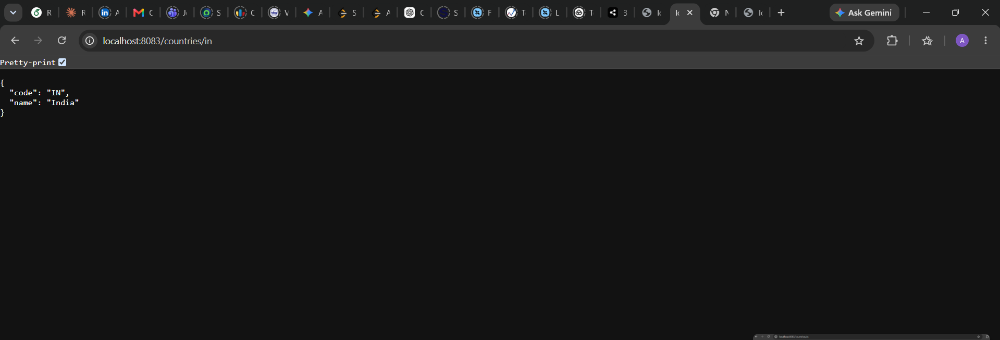
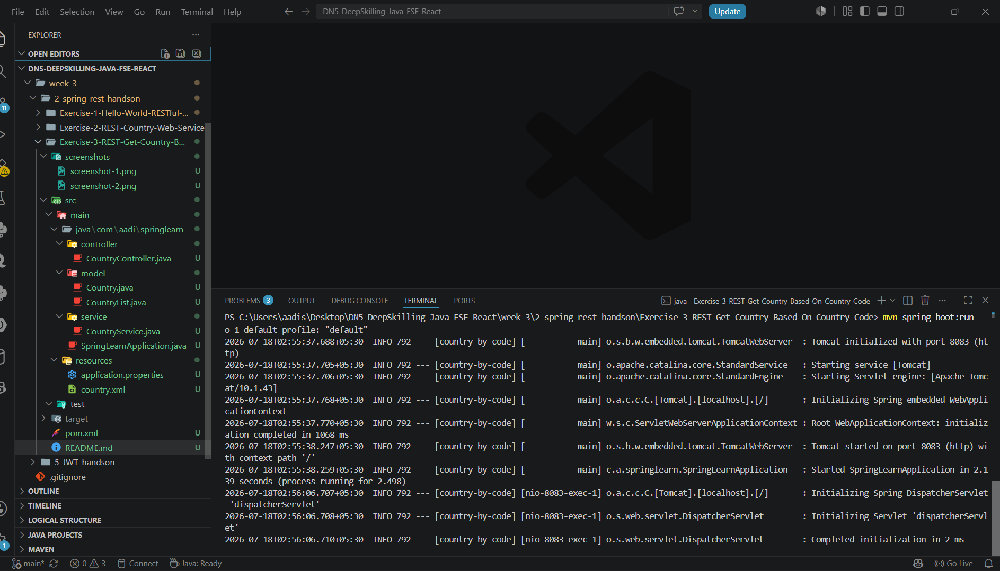

# REST - Get Country Based on Country Code

## Objective

Develop a RESTful Web Service that returns a country based on its country code using a case-insensitive search.

---

## Technologies Used

- Java 21
- Spring Boot 3
- Spring Web
- Maven
- Spring XML Configuration

---

## Project Structure

```
src
├── main
│   ├── java
│   │   └── com.aadi.springlearn
│   │       ├── controller
│   │       ├── model
│   │       ├── service
│   │       └── SpringLearnApplication.java
│   └── resources
│       ├── application.properties
│       └── country.xml
```

---

## Features

- REST endpoint `/countries/{code}`
- Reads country code using `@PathVariable`
- Loads country list from XML
- Performs case-insensitive search
- Returns matching country as JSON

---

## How to Run

```bash
mvn spring-boot:run
```

Open:

```
http://localhost:8083/countries/in
```

---

## Expected Output

```json
{
  "code": "IN",
  "name": "India"
}
```

---

## Output Screenshot







---

## Learning Outcome

- Learn `@PathVariable`
- Implement service layer in Spring Boot
- Load collections from XML configuration
- Perform case-insensitive search
- Convert Java objects to JSON automatically

---
