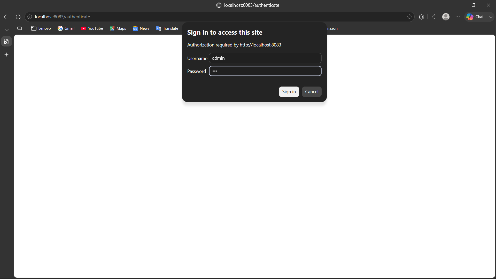
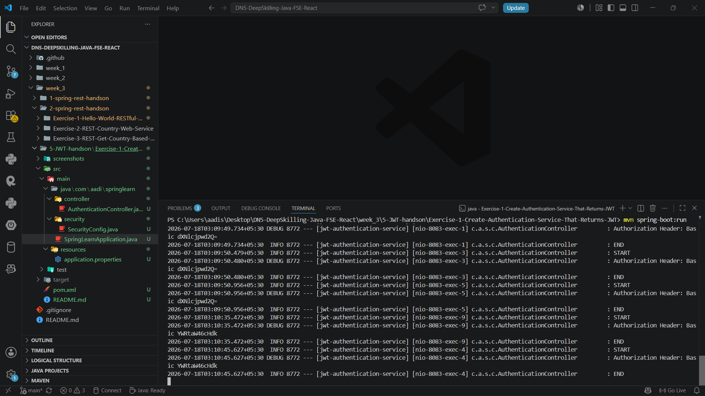

# Create Authentication Service That Returns JWT

## Objective

Implement a RESTful authentication service using Spring Boot and Spring Security that authenticates users through HTTP Basic Authentication and returns a JSON Web Token (JWT).

---

## Technologies Used

- Java 21
- Spring Boot 3
- Spring Security
- Spring Web
- Maven
- JJWT (Java JWT)
- SLF4J Logging

---

## Project Structure

```
Exercise-1-Create-Authentication-Service-That-Returns-JWT
│
├── src
│   ├── main
│   │   ├── java
│   │   │   └── com.aadi.springlearn
│   │   │       ├── controller
│   │   │       │   └── AuthenticationController.java
│   │   │       ├── security
│   │   │       │   └── SecurityConfig.java
│   │   │       └── SpringLearnApplication.java
│   │   └── resources
│   │       └── application.properties
│   └── test
│
├── screenshots
│   └── screenshot.png
│
├── pom.xml
└── README.md
```

---

## Features

- RESTful authentication endpoint
- HTTP Basic Authentication
- In-memory user authentication
- Role-based access configuration
- Reads Authorization header
- Decodes Base64 credentials
- Generates JWT token
- Returns JWT in JSON format
- SLF4J logging

---

## Default Credentials

| Username | Password | Role |
|----------|----------|------|
| user | pwd | USER |
| admin | pwd | ADMIN |

---

## API Endpoint

### Authenticate User

**Method**

```
GET
```

**URL**

```
http://localhost:8083/authenticate
```

**Authentication**

HTTP Basic Authentication

Example Credentials:

```
Username : user
Password : pwd
```

or

```
Username : admin
Password : pwd
```

---

## How to Run

1. Clone the repository.
2. Open the project in VS Code.
3. Build the project.

```bash
mvn clean install
```

4. Run the application.

```bash
mvn spring-boot:run
```

5. Open Postman or use cURL to test the endpoint.

---

## Expected Output

```json
{
  "token": "eyJhbGciOiJIUzI1NiJ9..."
}
```

---

## Output Screenshot





---

## Learning Outcome

- Understand Spring Security fundamentals.
- Configure HTTP Basic Authentication.
- Implement in-memory authentication.
- Read and decode HTTP Authorization headers.
- Generate JSON Web Tokens (JWT).
- Build secure RESTful authentication services using Spring Boot.

---

