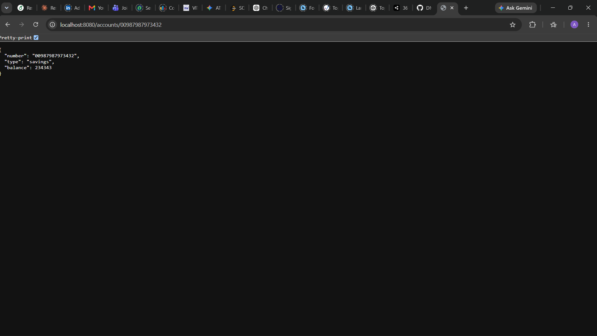
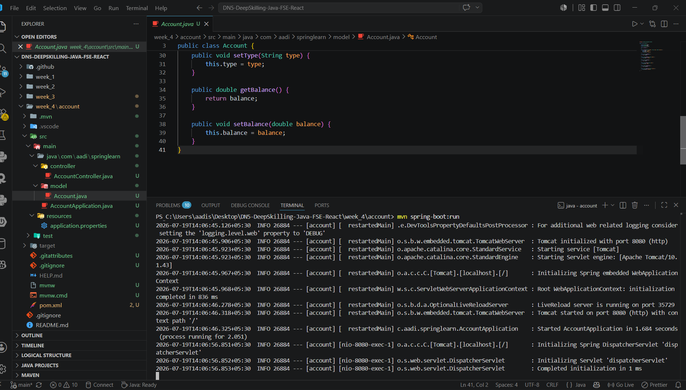
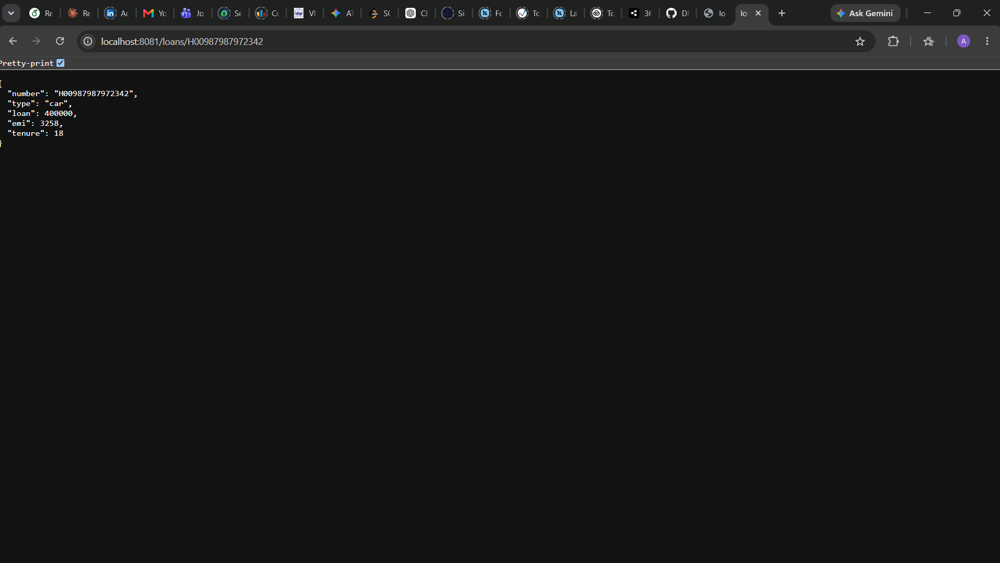
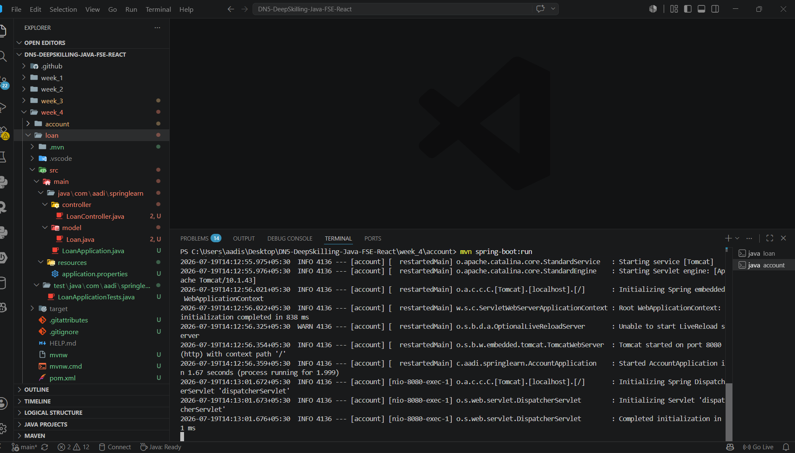

# Cognizant Digital Nurture 5.0 (Java FSE)

# Week 4 – Microservices with Spring Boot 3 and Spring Cloud

This repository contains the mandatory hands-on exercises completed as part of the **Cognizant Digital Nurture 5.0 – Java Full Stack Engineer** training program for **Week 4**, focusing on **Spring Boot 3**, **Microservices**, and **Spring Cloud**.

---

## Objective

The objective of this week's hands-on exercises is to understand and implement Spring Boot based microservices by:

- Developing independent RESTful microservices.
- Creating Account and Loan services.
- Running multiple services on different ports.
- Understanding Microservices architecture.
- Preparing for service discovery using Spring Cloud components.

---

## Technologies Used

- Java 21
- Spring Boot 3.x
- Spring Web
- Spring Boot DevTools
- Maven
- REST API
- VS Code

---

# Exercises Completed

## 1. Microservices with API Gateway

### Account Microservice

Implemented a RESTful Account Microservice that exposes the following endpoint:

```
GET /accounts/{number}
```

Sample Response

```json
{
    "number": "00987987973432",
    "type": "savings",
    "balance": 234343
}
```

---

### Loan Microservice

Implemented a RESTful Loan Microservice that exposes the following endpoint:

```
GET /loans/{number}
```

Sample Response

```json
{
    "number": "H00987987972342",
    "type": "car",
    "loan": 400000,
    "emi": 3258,
    "tenure": 18
}
```

The Loan Microservice is configured to run on **Port 8081** while the Account Microservice runs on **Port 8080**.

---

## Project Structure

```
Week_4
│
├── account
│   ├── src
│   ├── pom.xml
│   └── README.md (optional)
│
├── loan
│   ├── src
│   ├── pom.xml
│   └── README.md (optional)
│
├── screenshots
│   └── screenshot.png
│
└── README.md
```

---

## Features

- Spring Boot 3 based REST APIs
- Independent Maven projects
- Microservices architecture
- Separate Account and Loan services
- JSON response generation
- REST endpoint implementation
- Port configuration for multiple services
- GitHub-ready project structure

---

## REST Endpoints

### Account Service

| Method | Endpoint |
|---------|----------|
| GET | `/accounts/{number}` |

Example

```
http://localhost:8080/accounts/00987987973432
```

---

### Loan Service

| Method | Endpoint |
|---------|----------|
| GET | `/loans/{number}` |

Example

```
http://localhost:8081/loans/H00987987972342
```

---

## How to Run

### Account Service

1. Open the `account` project.
2. Build the project:

```bash
mvn clean install
```

3. Run the application:

```bash
mvn spring-boot:run
```

or run `AccountApplication.java`.

The service starts on:

```
http://localhost:8080
```

---

### Loan Service

1. Open the `loan` project.
2. Build the project:

```bash
mvn clean install
```

3. Run the application:

```bash
mvn spring-boot:run
```

or run `LoanApplication.java`.

The service starts on:

```
http://localhost:8081
```

---

## Expected Output

### Account Service

```
GET http://localhost:8080/accounts/00987987973432
```

Response

```json
{
    "number": "00987987973432",
    "type": "savings",
    "balance": 234343
}
```

---

### Loan Service

```
GET http://localhost:8081/loans/H00987987972342
```

Response

```json
{
    "number": "H00987987972342",
    "type": "car",
    "loan": 400000,
    "emi": 3258,
    "tenure": 18
}
```

---

## Output Screenshot









---

## Learning Outcome

After completing this week's exercises, I learned:

- Spring Boot 3 project creation
- Developing RESTful Web Services
- Building independent microservices
- Running multiple Spring Boot applications simultaneously
- Configuring custom server ports
- Returning JSON responses using REST controllers
- Organizing Maven-based microservice projects
- Basics of Microservices architecture

---

