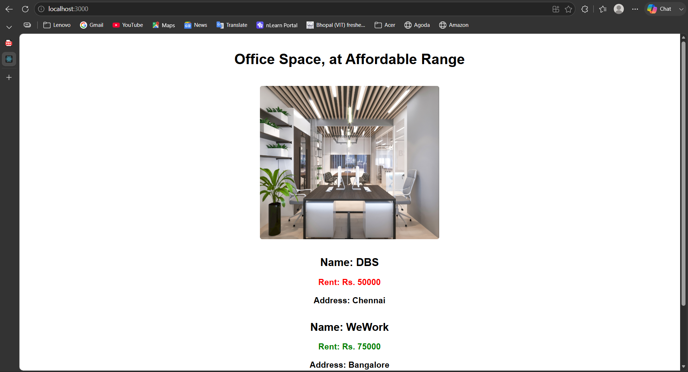

# ReactJS-HOL 1 – Office Space Rental App

## Objective

Develop a React application using JSX to display office space details. Learn how to create JSX elements, render objects and arrays, use JavaScript expressions inside JSX, and apply conditional inline styling.

---

## Technologies Used

- React
- JavaScript (ES6)
- JSX
- CSS
- Node.js
- npm
- Visual Studio Code

---

## Project Structure

```
officespacerentalapp/
│
├── public/
├── src/
│   ├── App.js
│   ├── App.css
│   ├── index.js
│   ├── index.css
│   └── office.jpg
│
├── screenshots/
│   └── screenshot.png
│
├── package.json
└── README.md
```

---

## Features

- Displays office space information using JSX.
- Displays an office image.
- Renders multiple office records using `map()`.
- Uses JavaScript expressions inside JSX.
- Applies conditional inline styling:
  - Rent ≤ 60000 → Red
  - Rent > 60000 → Green

---

## How to Run

1. Clone the repository.

2. Navigate to the project folder.

```bash
cd officespacerentalapp
```

3. Install dependencies.

```bash
npm install
```

4. Start the application.

```bash
npm start
```

5. Open:

```
http://localhost:3000
```

---

## Expected Output

- Office Space heading
- Office image
- Office details
- Rent displayed in different colors based on value

---

## Output Screenshot



---

## Learning Outcome

- Understanding JSX
- Rendering JSX elements
- Using JavaScript expressions
- Rendering lists with `map()`
- Conditional inline CSS styling
- React component structure

---

