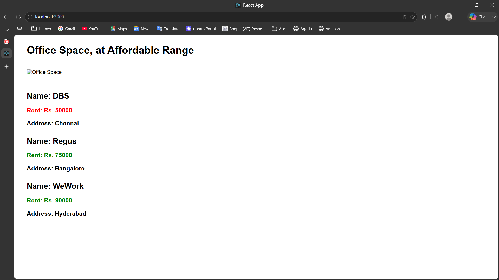

# Office Space Rental App

## Objective

This ReactJS Hands-on Lab demonstrates the use of JSX, JavaScript expressions, object rendering, list rendering using `map()`, and conditional inline CSS styling.

## Technologies Used

- ReactJS
- JavaScript (ES6)
- JSX
- CSS
- Create React App
- Visual Studio Code

## Folder Structure

```
officespacerentalapp/
│── public/
│    └── index.html
│
│── src/
│   ├── App.js
│   ├── App.css
│   ├── index.js
│   └── index.css
│
├── screenshots/
│   └── screenshot.png
│
├── package.json
└── README.md
```

## Features

- Displays Office Space heading
- Displays office image
- Displays office details
- Uses JSX
- Uses JavaScript expressions
- Displays multiple office records using `map()`
- Applies conditional inline CSS
  - Rent ≤ 60000 → Red
  - Rent > 60000 → Green

## How to Run

```bash
npm install
npm start
```

Open:

```
http://localhost:3000
```

## Expected Output

- Office Space heading
- Office image
- Office details
- Rent displayed in Red or Green based on its value

## Output Screenshot



## Learning Outcomes

- Understanding JSX
- Rendering JSX to the DOM
- Using JavaScript expressions in JSX
- Rendering lists with `map()`
- Applying conditional inline CSS
- Creating reusable React components