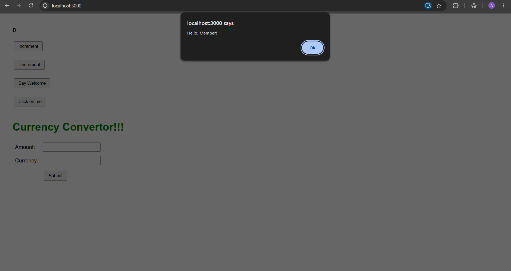
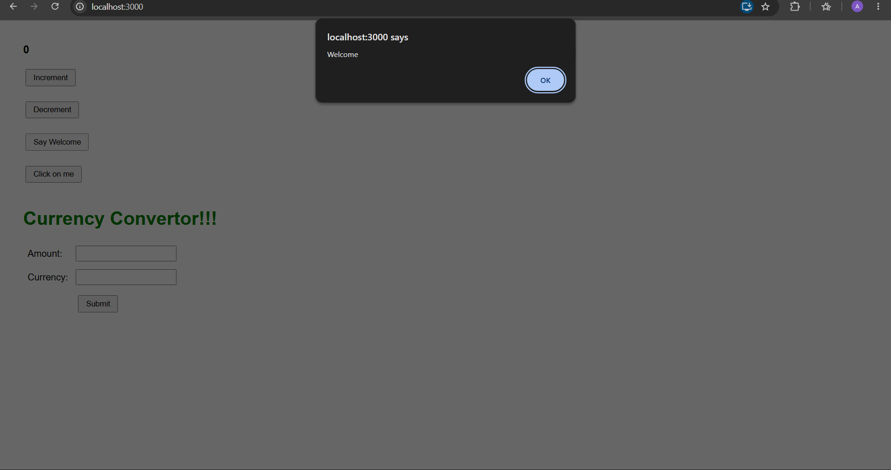
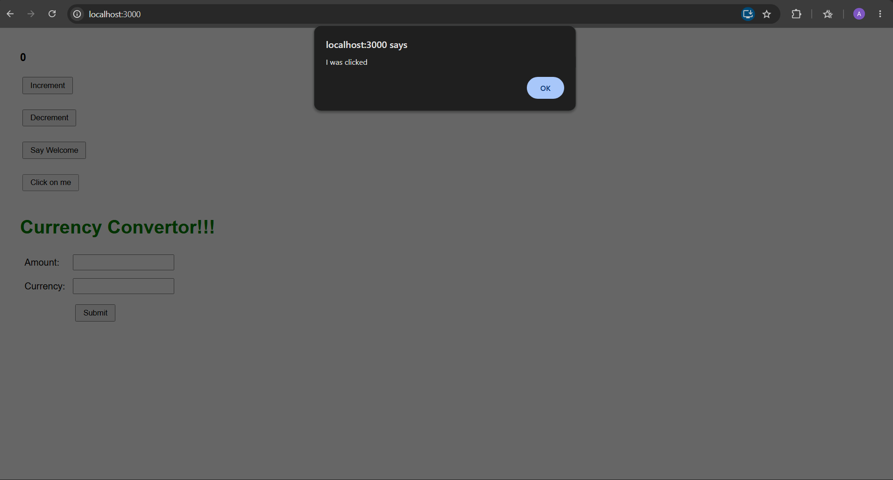
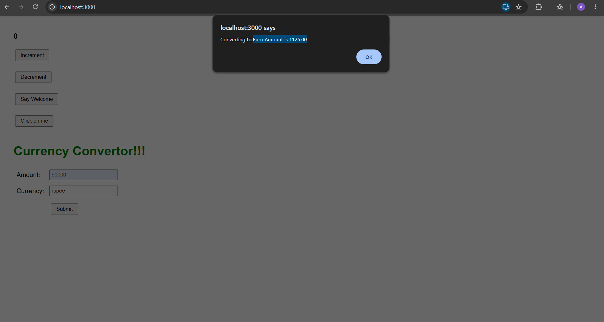

# ReactJS-HOL 11 – Event Handling

## Objective

The objective of this hands-on is to understand and implement **Event Handling in React**. This application demonstrates various event handling techniques such as button click events, passing arguments to event handlers, invoking multiple methods from a single event, handling synthetic events, and creating a simple currency converter using React.

---

## Technologies Used

- React
- JavaScript (ES6)
- JSX
- HTML5
- CSS3
- Node.js
- npm
- Create React App (CRA)

---

## Project Structure

```
eventexamplesapp
│
├── public
│
├── src
│   ├── components
│   │   ├── CurrencyConverter.js
│   │   └── EventExamples.js
│   │
│   ├── App.js
│   ├── App.css
│   ├── index.js
│   └── index.css
│
├── screenshots
│   └── screenshot.png
│
├── package.json
├── package-lock.json
└── README.md
```

---

## Features

- Counter using React State
- Increment counter
- Decrement counter
- Execute multiple functions from a single button click
- Pass arguments to event handlers
- Demonstrate React Synthetic Events
- Simple Currency Converter
- Alert messages for different user interactions

---

## How to Run

### 1. Clone the repository

```bash
git clone <repository-url>
```

### 2. Navigate to the project

```bash
cd eventexamplesapp
```

### 3. Install dependencies

```bash
npm install
```

### 4. Run the application

```bash
npm start
```

The application will start at:

```
http://localhost:3000
```

---

## Expected Output

The application should display:

- Counter with Increment and Decrement buttons.
- Clicking **Increment**:
  - Increases the counter.
  - Displays a "Hello! Member!" alert.
- Clicking **Decrement** decreases the counter.
- Clicking **Say Welcome** displays a Welcome message.
- Clicking **Click on me** displays "I was clicked".
- Currency Converter accepts Amount and Currency values and displays the converted amount when Submit is clicked.

---

## Output Screenshot









---

## Learning Outcome

After completing this hands-on, I learned:

- React Event Handling
- Event Binding
- Calling Multiple Functions from a Single Event
- Passing Parameters to Event Handlers
- Working with React Synthetic Events
- Handling Form Inputs
- React State Management
- Building a Simple Currency Converter

---

