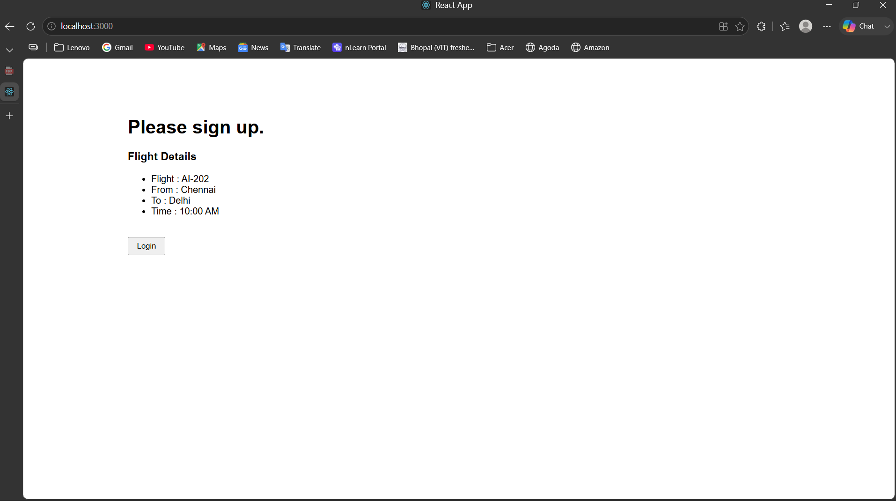
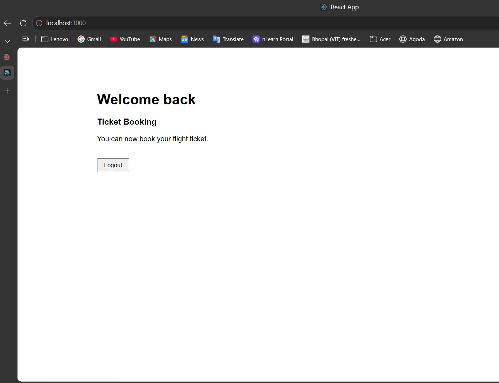

# Ticket Booking App

## Objective

This ReactJS Hands-on Lab demonstrates Conditional Rendering in React by displaying different pages for guest users and logged-in users.

## Technologies Used

- ReactJS
- JavaScript (ES6)
- JSX
- CSS
- Create React App
- Visual Studio Code

## Folder Structure

```
ticketbookingapp/
│── public/
│   └── index.html
│
│── src/
│   ├── components/
│   │   ├── Greeting.js
│   │   ├── GuestGreeting.js
│   │   ├── UserGreeting.js
│   │   ├── LoginButton.js
│   │   └── LogoutButton.js
│   │
│   ├── App.js
│   ├── App.css
│   ├── index.js
│   └── index.css
│
├── screenshots/
│   ├── screenshot-1.png
│   └── screenshot-2.png
│
├── package.json
└── README.md
```

## Features

- Conditional Rendering
- Login and Logout functionality
- Guest and User pages
- Flight details for guests
- Ticket booking page for logged-in users
- React Components
- Event Handling

## How to Run

```bash
npm install
npm start
```

Open:

```
http://localhost:3000
```

## Expected Output

- Guest page with Login button
- Flight details displayed for guest users
- User page displayed after Login
- Logout returns to the Guest page

## Output Screenshots

### Output 1



### Output 2



## Learning Outcomes

- Understanding Conditional Rendering
- Using Components in React
- Passing Props
- Event Handling
- Managing Component State using `useState`
- Rendering different UI based on application state