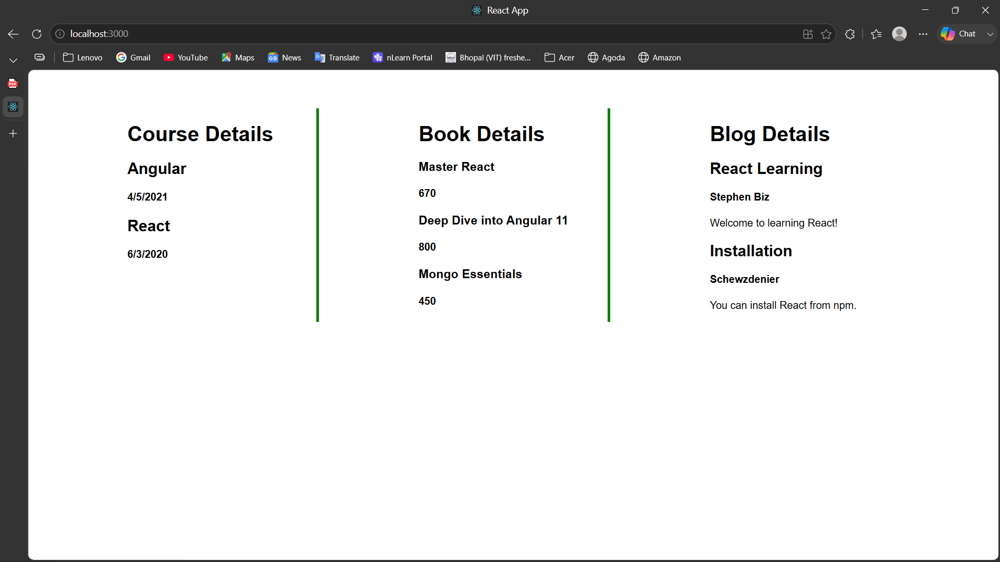

# Blogger App

## Objective

This ReactJS Hands-on Lab demonstrates the use of **Conditional Rendering**, **List Rendering**, **React Keys**, and the **map()** function by displaying Course Details, Book Details, and Blog Details in separate components.

## Technologies Used

- ReactJS
- JavaScript (ES6)
- JSX
- CSS
- Create React App (CRA)
- Visual Studio Code

## Folder Structure

```
bloggerapp/
│── public/
│   └── index.html
│
│── src/
│   ├── components/
│   │   ├── BookDetails.js
│   │   ├── BlogDetails.js
│   │   └── CourseDetails.js
│   │
│   ├── data/
│   │   ├── books.js
│   │   ├── blogs.js
│   │   └── courses.js
│   │
│   ├── App.js
│   ├── App.css
│   ├── index.js
│   └── index.css
│
├── screenshots/
│   └── screenshot.png
│
├── package.json
└── README.md
```

## Features

- Displays Course Details
- Displays Book Details
- Displays Blog Details
- Uses multiple React components
- Uses the `map()` function to render lists
- Uses unique `key` props while rendering lists
- Demonstrates Conditional Rendering using:
  - Logical AND (`&&`)
  - Ternary Operator (`condition ? component : null`)
- Responsive three-column layout

## How to Run

1. Clone the repository.

2. Navigate to the project folder.

3. Install dependencies:

```bash
npm install
```

4. Start the React development server:

```bash
npm start
```

5. Open your browser and visit:

```
http://localhost:3000
```

## Expected Output

The application displays three sections side by side:

- **Course Details**
  - Angular
  - React

- **Book Details**
  - Master React
  - Deep Dive into Angular 11
  - Mongo Essentials

- **Blog Details**
  - React Learning
  - Installation

The data is rendered dynamically using the `map()` function with unique keys, and conditional rendering techniques are demonstrated within the application.

## Output Screenshot



## Learning Outcomes

After completing this Hands-on Lab, you will understand:

- Conditional Rendering in React
- Different techniques for Conditional Rendering
- Rendering multiple React components
- Rendering lists using the `map()` function
- Importance of the `key` prop in React
- Component-based UI development
- Passing and displaying data in React components