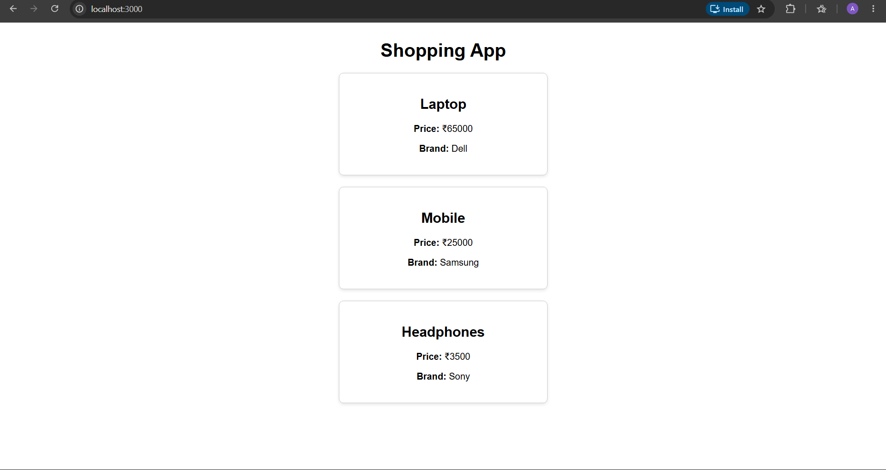

# ReactJS-HOL 2 – Shopping App (Props)

## Objective

Develop a React application to understand and implement **Props**. The application demonstrates how data can be passed from a parent component to child components and displayed using reusable React components.

---

## Technologies Used

- React
- JavaScript (ES6)
- JSX
- CSS
- Node.js
- npm
- Visual Studio Code

---

## Project Structure

```
shoppingapp/
│
├── public/
│
├── src/
│   ├── components/
│   │   ├── Product.js
│   │   └── Products.js
│   │
│   ├── App.js
│   ├── App.css
│   ├── index.js
│   └── index.css
│
├── screenshots/
│   └── screenshot.png
│
├── package.json
├── package-lock.json
└── README.md
```

---

## Features

- Demonstrates React Props.
- Parent component passes data to child components.
- Reusable Product component.
- Displays multiple products using `map()`.
- Clean and responsive product cards.

---

## How to Run

1. Clone the repository.

2. Navigate to the project folder.

```bash
cd shoppingapp
```

3. Install dependencies.

```bash
npm install
```

4. Start the React application.

```bash
npm start
```

5. Open your browser and visit:

```
http://localhost:3000
```

---

## Expected Output

The application displays:

- Shopping App heading
- Multiple product cards
- Product Name
- Product Price
- Product Brand

The product information is displayed using reusable child components through React Props.

---

## Output Screenshot



---

## Learning Outcome

After completing this exercise, you will understand:

- React Props
- Parent-to-child communication
- Component reusability
- Passing data through Props
- Rendering lists using `map()`

---
