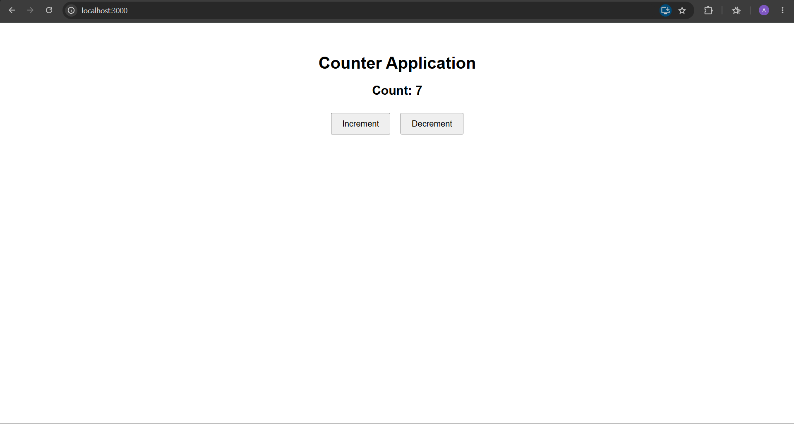

# ReactJS-HOL 3 – Counter App (State)

## Objective

Develop a React application to understand and implement **State** using a class component. The application demonstrates how state is initialized and updated dynamically using `setState()`.

---

## Technologies Used

- React
- JavaScript (ES6)
- JSX
- CSS
- Node.js
- npm
- Visual Studio Code

---

## Project Structure

```
counterapp/
│
├── public/
│
├── src/
│   ├── Counter.js
│   ├── App.js
│   ├── App.css
│   ├── index.js
│   └── index.css
│
├── screenshots/
│   └── screenshot.png
│
├── package.json
├── package-lock.json
└── README.md
```

---

## Features

- Demonstrates React State.
- Uses a class component.
- Updates state using `setState()`.
- Increment and decrement functionality.
- Automatic UI updates.

---

## How to Run

```bash
cd counterapp
npm install
npm start
```

Open:

```
http://localhost:3000
```

---

## Expected Output

- Counter Application heading
- Counter value
- Increment button
- Decrement button

---

## Output Screenshot



---

## Learning Outcome

- Understanding React State
- Class Components
- `setState()`
- Event handling
- Automatic UI rendering

---
