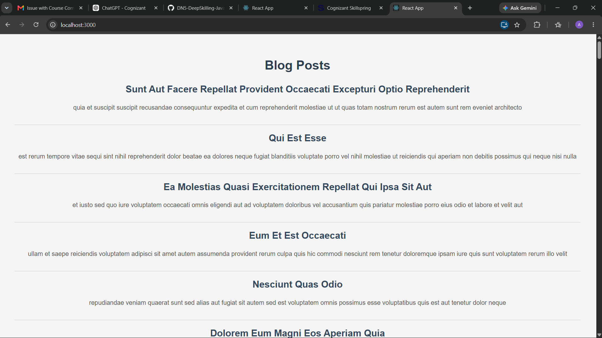

# ReactJS-HOL – Component Lifecycle (blogapp)

## Objective

The objective of this hands-on is to understand and implement **React Component Lifecycle Methods**. This application demonstrates the use of the `componentDidMount()` lifecycle hook to fetch data from a REST API and `componentDidCatch()` for handling runtime errors gracefully.

---

## Technologies Used

- React
- JavaScript (ES6)
- JSX
- HTML5
- CSS3
- Node.js
- npm
- Create React App (CRA)
- Fetch API

---

## Project Structure

```
blogapp
│
├── public
│
├── src
│   ├── App.js
│   ├── App.css
│   ├── index.js
│   ├── index.css
│   ├── Post.js
│   └── Posts.js
│
├── screenshots
│   └── screenshot.png
│
├── package.json
├── package-lock.json
└── README.md
```

---

## Features

- Demonstrates React Class Components
- Uses the `componentDidMount()` lifecycle method
- Fetches blog posts from a REST API
- Stores fetched data in component state
- Displays blog post titles and descriptions
- Implements `componentDidCatch()` for error handling
- Clean and responsive user interface

---

## How to Run

### 1. Clone the repository

```bash
git clone <repository-url>
```

### 2. Navigate to the project folder

```bash
cd blogapp
```

### 3. Install dependencies

```bash
npm install
```

### 4. Run the application

```bash
npm start
```

The application will start at:

```
http://localhost:3000
```

---

## Testing Steps

1. Run the application using:

   ```bash
   npm start
   ```

2. Open your browser and navigate to:

   ```
   http://localhost:3000
   ```

3. Verify that the application fetches blog posts from the JSONPlaceholder API.

4. Ensure that each post displays:
   - Post Title
   - Post Body

5. If any runtime error occurs while rendering, verify that `componentDidCatch()` handles it appropriately.

---

## Expected Output

- The application displays the heading **"Blog Posts"**.
- Blog posts are fetched automatically when the component loads.
- Each post displays:
  - Title
  - Description (Body)
- The page loads without requiring any user interaction.
- Errors, if any, are handled using the lifecycle error handler.

---

## Output Screenshot



---

## Learning Outcome

After completing this hands-on, I learned:

- React Component Lifecycle
- React Class Components
- Constructor and State Initialization
- Using `componentDidMount()`
- Fetching data using the Fetch API
- Rendering dynamic data using `map()`
- Error handling using `componentDidCatch()`
- Managing component state
- Building a simple REST API-based React application

---
