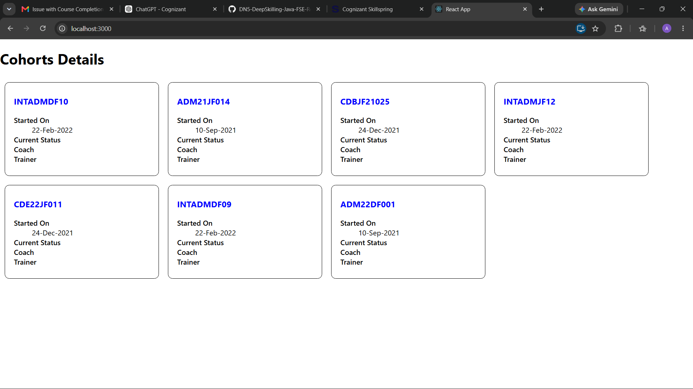

# ReactJS-HOL 5 – Styling React Components

## Objective

This hands-on demonstrates how to style React components using CSS Modules and inline styles.

---

## Technologies Used

- ReactJS
- JavaScript (ES6)
- CSS Modules
- Create React App

---

## Project Structure

```
cohort-1
│
├── public
├── src
│   ├── App.js
│   ├── App.css
│   ├── Cohort.js
│   ├── CohortDetails.js
│   ├── CohortDetails.module.css
│   ├── index.js
│   └── index.css
│
├── screenshots
│   └── screenshot.png
│
├── package.json
└── README.md
```

---

## Features

- Displays multiple cohort cards.
- Uses CSS Modules for component-level styling.
- Applies inline styles dynamically based on cohort status.
- Responsive card layout using `inline-block`.
- Rounded card borders with spacing.

---

## Styling Implemented

### CSS Module

- Width: 300px
- Display: inline-block
- Margin: 10px
- Padding: 10px 20px
- 1px black border
- Border radius: 10px

### Inline Style

- **Green** heading for ongoing cohorts.
- **Blue** heading for completed cohorts.

---

## How to Run

Install dependencies:

```bash
npm install
```

Start the application:

```bash
npm start
```

Open:

```
http://localhost:3000
```

---

## Expected Output

- Cohort cards displayed with CSS Module styling.
- Ongoing cohorts shown with green headings.
- Completed cohorts shown with blue headings.

---

## Output Screenshot

Place the output screenshot inside:

```
screenshots/screenshot.png
```

Add it to the README:

```markdown

```

---

## Learning Outcome

By completing this exercise, you learn:

- CSS Modules in React
- Component-specific styling
- Inline styles
- Conditional styling based on component data
- Combining CSS Modules with React components

