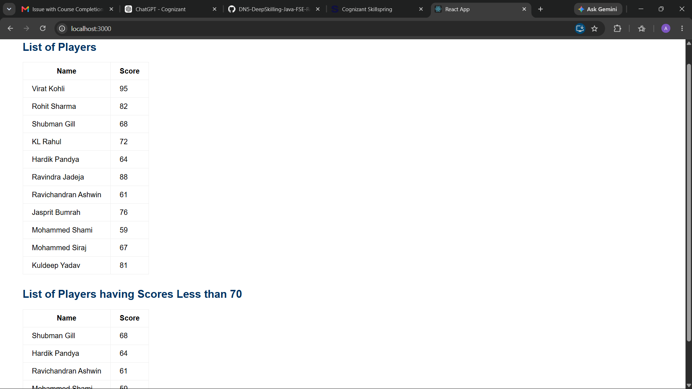
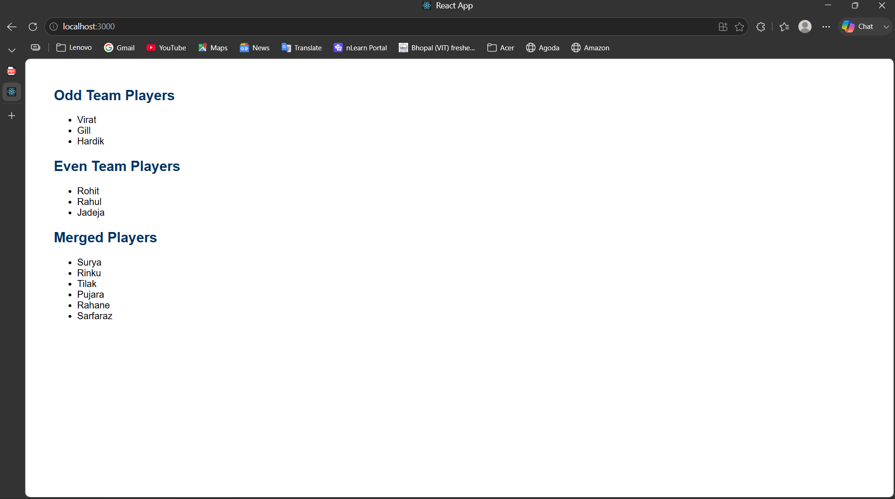

# ReactJS-HOL 9 – ES6 Features in React

## Objective

This hands-on demonstrates the use of ES6 features in React, including `map()`, arrow functions, array destructuring, spread operator, and conditional rendering.

---

## Technologies Used

- ReactJS
- JavaScript (ES6)
- Create React App

---

## Project Structure

```
cricketapp
│
├── src
│   ├── App.js
│   ├── App.css
│   ├── index.js
│   ├── index.css
│   ├── ListOfPlayers.js
│   └── IndianPlayers.js
│
├── screenshots
│   ├── screenshot-flag-true.png
│   └── screenshot-flag-false.png
│
├── package.json
└── README.md
```

---

## Features

- Displays a list of cricket players using the ES6 `map()` method.
- Filters players with scores below 70 using arrow functions.
- Demonstrates array destructuring by separating odd and even team players.
- Merges two arrays using the ES6 spread (`...`) operator.
- Uses a flag variable with a simple `if-else` statement for conditional rendering.

---

## ES6 Concepts Used

- `map()`
- `filter()`
- Arrow Functions
- Array Destructuring
- Spread Operator
- Conditional Rendering

---

## How to Run

Install dependencies:

```bash
npm install
```

Start the application:

```bash
npm start
```

Open your browser and visit:

```
http://localhost:3000
```

---

## Expected Output

### When `flag = true`

- Displays all 11 cricket players.
- Displays players with scores less than 70.

### When `flag = false`

- Displays Odd Team Players.
- Displays Even Team Players.
- Displays the merged list of T20 and Ranji Trophy players.

---

## Output Screenshots

Store the screenshots in the following folder:

```
screenshots/
```

### Flag = true

```markdown

```

### Flag = false

```markdown

```

---

## Learning Outcomes

After completing this exercise, you will understand:

- ES6 `map()` for rendering collections.
- Arrow functions for concise syntax.
- Array filtering using `filter()`.
- Array destructuring.
- Merging arrays using the spread operator.
- Conditional rendering in React.

---
